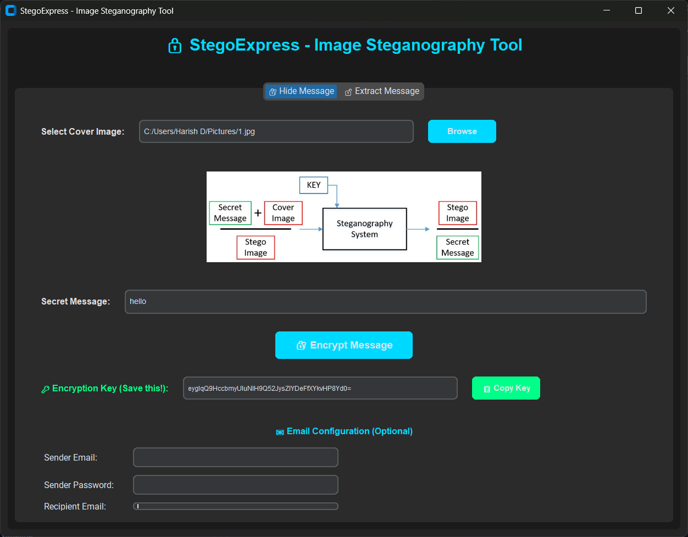
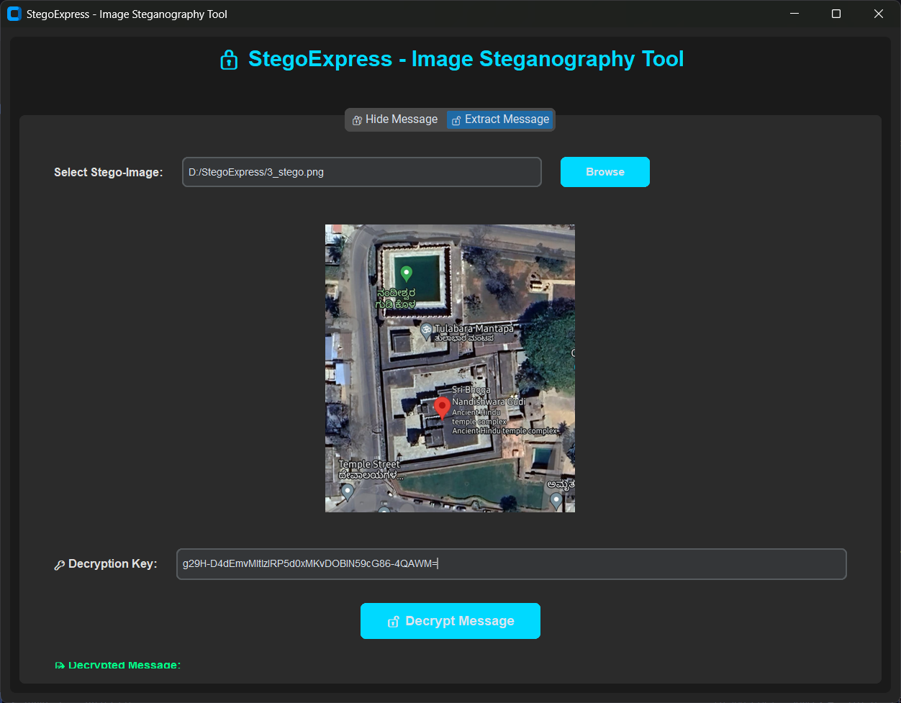

# 🔒 StegoExpress - Image Steganography Tool

[](https://www.python.org/) 
[](https://github.com/TomSchimansky/CustomTkinter)
[](./LICENSE)
[](https://github.com/harish-d2023/StegoExpress)

<div align="center">
  
  
  ### Secure Message Hiding with Modern UI
  *Hide encrypted messages within images using LSB steganography*
</div>

---

## 📋 Table of Contents
- [Overview](#-overview)
- [Features](#-features)
- [Screenshots](#-screenshots)
- [Technology Stack](#-technology-stack)
- [Getting Started](#-getting-started)
- [Usage Guide](#-usage-guide)
- [How It Works](#-how-it-works)
- [Project Details](#-project-details)
- [Contributing](#-contributing)
- [License](#-license)
- [Acknowledgements](#-acknowledgements)

---

## 🌟 Overview

**StegoExpress** is a modern desktop application that combines **steganography** and **cryptography** to securely hide secret messages within image files. Built with a sleek dark-themed GUI using CustomTkinter, it provides an intuitive interface for embedding and extracting encrypted messages using the Least Significant Bit (LSB) algorithm combined with Fernet encryption.

Perfect for:
- 🔐 Secure communication
- 🎓 Educational purposes (cybersecurity, cryptography)
- 🧪 Research projects
- 💼 Privacy-focused messaging

---

## ✨ Features

### 🎨 Modern User Interface
- **Dark Theme**: Professional dark mode with electric blue (#00D9FF) accents
- **Tabbed Navigation**: Separate tabs for Hide and Extract operations
- **Scrollable Content**: Smooth scrolling on both tabs for easy access to all fields
- **Large Image Previews**: 500x400px preview area for better visualization
- **Real-time Status Bar**: Color-coded feedback for all operations
- **Responsive Design**: Clean, modern layout with rounded corners and hover effects

### 🔐 Security Features
- **LSB Steganography**: Hide messages in the least significant bits of image pixels
- **Fernet Encryption**: Military-grade symmetric encryption for messages
- **Key Generation**: Automatic cryptographic key generation
- **One-Click Key Copy**: Copy encryption keys to clipboard instantly

### 📧 Email Integration
- **Direct Email Sending**: Send stego-images and keys via Gmail SMTP
- **Smart UI**: Email section appears only after successful encryption
- **Secure Credentials**: Password fields with masked input

### 🖼️ Image Support
- **Multiple Formats**: PNG, JPG, JPEG support
- **Before/After Preview**: View original and stego-images
- **Automatic Conversion**: Output saved as PNG for lossless storage

### 💬 Message Handling
- **Text Encryption**: Hide any text message within images
- **Decryption Display**: View decrypted messages in a dedicated text box
- **Error Handling**: Clear error messages for invalid keys or corrupted images

---

## 📸 Screenshots
<div align="center">
  
    
  ### Hide Message Interface
  *Modern tabbed interface with image preview, message input, and email configuration*
 </div>

 <div align="center">
  

   ### Extract Message Interface
  *Clean decryption interface with scrollable message display*
 </div>  

---

## 🛠️ Technology Stack

| Component | Technology |
|-----------|-----------|
| **GUI Framework** | [CustomTkinter](https://github.com/TomSchimansky/CustomTkinter) 5.2.2+ |
| **Encryption** | [Cryptography](https://cryptography.io/) (Fernet) |
| **Image Processing** | [Pillow](https://python-pillow.org/) (PIL) |
| **Email** | smtplib (Python standard library) |
| **Language** | Python 3.8+ |

---

## 🚀 Getting Started

### Prerequisites
- **Python 3.8 or higher**
- **pip** (Python package manager)
- **Git** (for cloning the repository)

### Installation

1. **Clone the repository:**
   ```bash
   git clone https://github.com/harish-d2023/StegoExpress.git
   cd StegoExpress
   ```

2. **Install dependencies:**
   ```bash
   pip install -r requirements.txt
   ```
   
   This will install:
   - `cryptography` - For Fernet encryption
   - `Pillow` - For image processing
   - `customtkinter` - For modern GUI

3. **Run the application:**
   ```bash
   python steganography_app.py
   ```

### 📦 Packaging as Executable (Optional)

Create a standalone executable for Windows:

```bash
pip install pyinstaller
pyinstaller --onefile --windowed --icon=logo.png steganography_app.py
```

The executable will be available in the `dist/` folder.

---

## 📖 Usage Guide

### 🔐 Hide Message Mode

1. **Select Cover Image**
   - Click the **Browse** button
   - Choose a PNG or JPG image (larger images can hide more data)

2. **Enter Secret Message**
   - Type your message in the "Secret Message" field

3. **Encrypt Message**
   - Click **🔐 Encrypt Message**
   - The encryption key will be displayed automatically
   - Click **📋 Copy Key** to copy it to clipboard
   - **IMPORTANT**: Save this key! You'll need it for decryption

4. **Send via Email (Optional)**
   - After encryption, the email section will appear
   - Enter sender email, password (use [App Password](https://support.google.com/accounts/answer/185833) for Gmail)
   - Enter recipient email
   - Click **📤 Send via Email**

5. **Output**
   - Stego-image saved as `[original_name]_stego.png`
   - Share this image and the encryption key separately

### 🔓 Extract Message Mode

1. **Select Stego-Image**
   - Click **Browse** and select the encrypted image

2. **Enter Decryption Key**
   - Paste the encryption key you received

3. **Decrypt Message**
   - Click **🔓 Decrypt Message**
   - Scroll down to view the decrypted message in the text box

---

## 🔬 How It Works

### Encryption Process

```
Original Message → Fernet Encryption → Binary Conversion → LSB Embedding → Stego-Image
```

1. **Message Encryption**: Your message is encrypted using Fernet (AES-128)
2. **Binary Conversion**: Encrypted data is converted to binary format
3. **LSB Embedding**: Binary data is hidden in the least significant bits of RGB pixel values
4. **Image Output**: Modified image is saved as PNG (lossless format)

### Decryption Process

```
Stego-Image → LSB Extraction → Binary to Bytes → Fernet Decryption → Original Message
```

1. **LSB Extraction**: Extract the least significant bits from each pixel
2. **Binary Reconstruction**: Convert binary data back to bytes
3. **Fernet Decryption**: Decrypt using the provided key
4. **Message Display**: Show the original message

### Security Considerations

- ✅ **Strong Encryption**: Fernet uses AES-128 in CBC mode with HMAC authentication
- ✅ **Visual Imperceptibility**: LSB changes are invisible to the human eye
- ✅ **Key-based Security**: Without the key, decryption is computationally infeasible
- ⚠️ **Limitations**: 
  - Stego-image should not be re-compressed (use PNG, not JPG)
  - Image modifications may corrupt hidden data
  - Message size limited by image dimensions

---

## 📊 Project Details

| Field | Details |
|-------|---------|
| **Project Name** | StegoExpress - Image Steganography using LSB |
| **Description** | Secure message hiding with encryption in images using LSB algorithm |
| **Version** | 2.0 (Modernized GUI) |
| **Status** | ✅ Active Development |
| **Start Date** | November 16, 2024 |
| **Last Updated** | December 3, 2025 |

### 👨‍💻 Developers

| Name | Email | Role |
|------|-------|------|
| **Naresh G** | gnaresh3003@gmail.com | Lead Developer |
| **Harish D** | harishd@gmail.com | Co-Developer |

### 🎯 Development Milestones

- ✅ **v1.0** - Custom Tkinter GUI with LSB steganography
- ✅ **v1.5** - Added Fernet encryption and email integration
- ✅ **v2.0** - Modernized GUI with CustomTkinter, tabbed interface, scrolling support

---

## 🤝 Contributing

Contributions are welcome! Here's how you can help:

1. **Fork the repository**
2. **Create a feature branch** (`git checkout -b feature/AmazingFeature`)
3. **Commit your changes** (`git commit -m 'Add some AmazingFeature'`)
4. **Push to the branch** (`git push origin feature/AmazingFeature`)
5. **Open a Pull Request**

### Areas for Contribution
- 🎨 UI/UX improvements
- 🔐 Additional encryption algorithms
- 📱 Cross-platform testing
- 📝 Documentation enhancements
- 🐛 Bug fixes and optimizations

---

## 📄 License

This project is for **educational and research purposes only**. 

- ✅ Free to use for learning and non-commercial projects
- ✅ Modify and distribute with attribution
- ❌ Commercial use requires permission

For commercial licensing, please contact: **harishd2023@gmail.com**

See [LICENSE](./LICENSE) for more details.

---

## 🙏 Acknowledgements

- Developed as part of a **Cyber Security Internship** project
- Built to help secure organizations from cyber fraud through education
- Powered by:
  - [CustomTkinter](https://github.com/TomSchimansky/CustomTkinter) by Tom Schimansky
  - [Cryptography](https://cryptography.io/) library
  - [Pillow](https://python-pillow.org/) (PIL Fork)
- Special thanks to the open-source community

---

## 🐛 Issues & Support

Encountered a bug or have a feature request?

- 📝 [Open an Issue](https://github.com/harish-d2023/StegoExpress/issues)
- 💬 [Discussions](https://github.com/harish-d2023/StegoExpress/discussions)
- 📧 Email: harishd2023@gmail.com

---

## ⭐ Show Your Support

If you found this project helpful, please consider:
- ⭐ Starring the repository
- 🍴 Forking for your own projects
- 📢 Sharing with others interested in steganography

---

<div align="center">
  
  **Made with ❤️ for Cybersecurity Education**
  
  [⬆ Back to Top](#-stegoexpress---image-steganography-tool)
  
</div>
